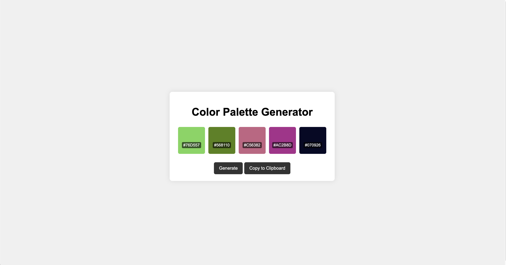

# Color Palette Generator

Generate beautiful color palettes with ease. Perfect for designers, artists, and anyone in need of color inspiration!

 

## Features

- **Random Palettes**: Generate random color palettes with a single click.
- **Copy to Clipboard**: Easily copy generated palettes to your clipboard.
- **Clean UI**: A simple and clean user interface for an enjoyable experience.

## Getting Started

These instructions will help you set up the Color Palette Generator on your local machine for development and testing.

### Prerequisites

- A web browser
- A text editor (optional)

### Installation

1. Clone the repository or download the ZIP file.
    ```bash
    git clone https://github.com/your-github-username/color-palette-generator.git
    ```
2. Navigate to the project directory.
3. Open `index.html` in your preferred web browser.

## Usage

1. Click the **Generate** button to create a new color palette.
2. If you like a palette, click **Copy to Clipboard** to copy the HEX codes.
3. Explore, experiment, and enjoy!

## Future Features

- Save palettes for future use.
- Lock specific colors.
- Manual color input.

## Contributing

If you'd like to contribute, please fork the repository and make changes as you'd like. Pull requests are warmly welcome.

1. Fork the Project
2. Create your Feature Branch (`git checkout -b feature/AmazingFeature`)
3. Commit your Changes (`git commit -m 'Add some AmazingFeature'`)
4. Push to the Branch (`git push origin feature/AmazingFeature`)
5. Open a Pull Request

